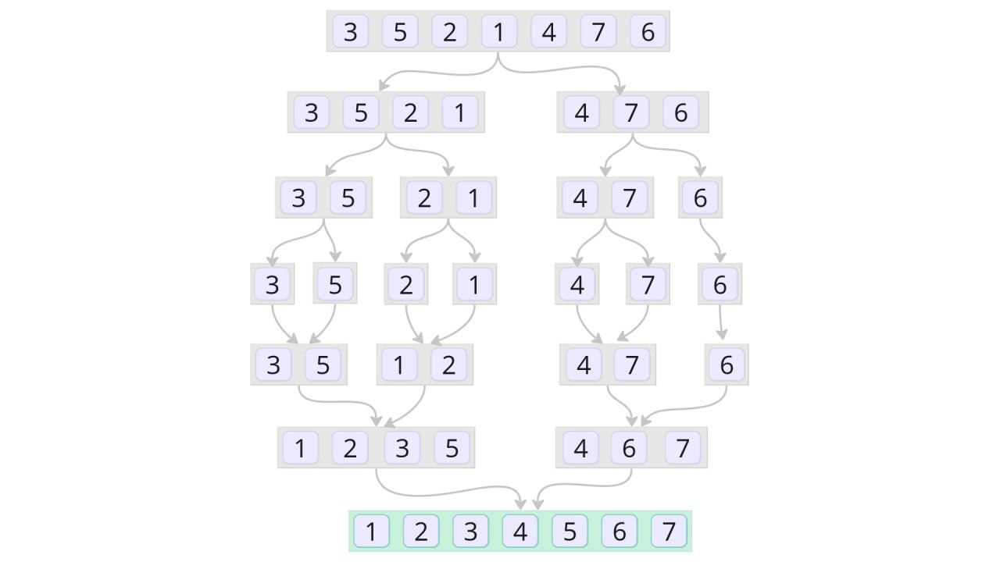

# Глава 7. Функции
## Объявлении и вызов функции 
Мы уже встречались с функциями ранее. В данной главе функции будут рассмотрены более подробно.  

Объявление функции соответствует следующему шаблону:

```
func имя функции(параметры)(возвращаемые значения){
    тело
}
``` 

Функция подсчета площади прямоугольника: 

```go {.example_for_playground .example_for_playground_001}
func rectangleSquare(width float64, height float64) float64 {
	return width * height
}
```

Напишите функцию с именем `rectangleSquareByPoints`, которая считает площадь прямоугольника по координатам его левого нижнего и правого верхнего углов. В качестве типа данных для координат точек и результата используйте `float64`. {.task_text}

```go {.task_source #golang_chapter_0070_task_0010}
package main
import "fmt"

// ваш код здесь 

func main() {
    // (3; -4) - левый нижний угол, (15; 10) - правый верхний
	fmt.Println(rectangleSquareByPoints(3, -4, 15, 10))
}

// либо здесь

``` 
Реализуйте функцию, которая возвращает произведение разности соответствующих координат. {.task_hint}

```go {.task_answer}
package main

import (
	"fmt"
)

func main() {
	fmt.Println(rectangleSquareByPoints(15, 10, 3, -4))
}

func rectangleSquareByPoints(x0 float64, y0 float64, x1 float64, y1 float64) float64 {
	return (x1 - x0) * (y1 - y0)
}
```

## Сокращенная запись типов принимаемых аргументов
Если у нескольких подряд идущих параметров функции совпадает тип, то его можно указать только для последнего из них. А для остальных пропустить. Вот так могла бы выглядеть функция подсчета площади прямоугольника: 

```go {.example_for_playground .example_for_playground_002}
func rectangleSquare(width, height float64) float64 {
	return width * height
}
```

## Именованные возвращаемые значения
Чтобы сделать код функции более лаконичным, иногда используют именованные возвращаемые значения: 

```go {.example_for_playground .example_for_playground_003}
func average(s []float64) (res float64) {
	for _, el := range s {
		res += el / float64(len(s))
	}
	return
}
```

## Функции без возвращаемых значений
Функция не обязана возвращать какие-либо значения вообще. В случае, когда в этом нет необходимости, возвращаемые значения не указываются:

```go {.example_for_playground .example_for_playground_004}
func hello(name string) {
	fmt.Printf("Hello, %s!\n", name)
}
``` 

Кстати, функция `main` пакета `main` как раз является функцией без принимаемых и возвращаемых значений.

## Механизм передачи аргументов в функцию
Аргументы передаются в функцию **по значению**. Это означает, что изменения копии не влияют на исходный объект. Если аргумент представляет собой ссылку, то функция может влиять на объект через эту ссылку. Например, срез является ссылочным типом. Следующая функция реализует метод сортировки среза пузырьком. Она принимает на вход срез и ничего не возвращает. Срез после вызова такой функции окажется отсортированным, потому что функция косвенно повлияла на срез через эту ссылку. 

```go {.example_for_playground .example_for_playground_011}
package main

import (
	"fmt"
)

func main() {
	s := []int{10, 8, 3, 7, 6, 1, 0, 4}
	BubbleSort(s)
	fmt.Println(s)
}

func BubbleSort(s []int) {
	for i := 0; i < len(s)-1; i++ {
		for j := 0; j < len(s)-i-1; j++ {
			if s[j] > s[j+1] {
				s[j], s[j+1] = s[j+1], s[j]
			}
		}
	}
}
```

## Отложенные вызовы функций
Вызов функции бывает удобно отложить. Например, при выводе приветствия пользователю мы точно знаем, что в конце программы попрощаемся с ним. Чтобы не забыть это сделать в последствии, используют ключевое слово `defer`:

```go {.example_for_playground .example_for_playground_005}
package main

import (
	"fmt"
)

func hello(name string) {
	fmt.Printf("Hello, %s!\n", name)
}

func goodbuy(name string) {
	fmt.Printf("Goodbuy, %s!\n", name)
}

func main() {
	sep := "===================="
	hello("gopher")
	defer goodbuy("gopher")
	fmt.Println(sep)
	fmt.Println("Here we study defer")
	fmt.Println(sep)
}
```

Вызов функции `goodbuy` откладывается до завершения функции `main`, независимо от того, как эта функция завершится: с ошибкой или без нее. Допустимо откладывать любой количество вызов. Выполняются они в порядке, обратном тому, в котором были отложены. 

## Аварийные ситуации
Компилятор языка Go проверяет все ошибки, которые может проверить, на этапе компиляции нашей программы. Однако существуют ошибки разработки, которые могут быть выявлены только на этапе времени выполнения. Например, выход за границы массива или разыменование нулевого указателя. В этих случаях возникает аварийная ситуация или, говоря в терминах языка Go, *паника (panic)*. 

В этом случае выполнение пользовательской программы прекращается, выполняются все отложенные функции и происходит выход с печатью сообщения о том, в каком месте и по какой причине возникла паника. 

Панику вызывают самостоятельно, когда происходит некоторая недопустимая ситуация. Например, деление на нуль или достижение одного из условий, до которого программа не должна была дойти:

```go {.example_for_playground .example_for_playground_006}
func hello(name string) {
	fmt.Printf("Hello, %s!\n", name)
}

func main() {
	grade := "bookeeper"

	if grade == "junior" || grade == "middle" || grade == "senior" {
		hello(grade)
	} else {
		panic(fmt.Sprintf("no such grade: %s", grade))
	}

}
```

**Паника вызывается тогда и только тогда, когда возникает ошибка в логике программы**. Так, если бы `grade` задавался с клавиатуры пользователем и не соответствовал одному из заранее заданных значений, то это ошибка ввода. В этом случае паника недопустима. Такая ошибка должна быть обработана другими средствами. Например, достаточно вывести ошибку на экран и попросить ввести `grade` повторно. Однако, если `grade` задан изначально программистом в коде, и по логике работы программы другое его значение невозможно, то смело вызывайте панику. В надежных программах паника не возникает никогда.

## Восстановление
Иногда в случае паники необходимо выполнить дополнительные действия. Например, если веб-сервер завершается с паникой, то он может отключить всех клиентов, а потом завершить работу, а не оставлять другие машины зависшими. Для этого используют ключевое слово `recover`:

```go {.example_for_playground .example_for_playground_007}
package main

import (
	"fmt"
	"time"
)

func startServer() {
	defer func() {
		if p := recover(); p != nil {
			fmt.Printf("Internal error: %s. Closing all connections...", p)
		}
	}()

	time.Sleep(1 * time.Millisecond) // server is working
	panic("memory leak")
}

func main() {
	startServer()
}
```

Полное восстановление после паники не рекомендуется, потому что после паники состояние переменных пакета может оказаться непредсказуемым. Кроме того, такое восстановление может привести к тому, что критическая ошибка окажется попросту незамеченной.

## Функции, возвращающие несколько значений
Функция может возвращать более одного значения. Часто в качестве последнего значения указывают значение специального типа `error` — ошибки. В случае, когда ошибка произошла, функция вернет значение этого типа с сообщением о том, что пошло не так. Если ошибки не было, то вернется `nil`. Получив ошибку, ее необходимо обработать на месте или вернуть выше:

```go {.example_for_playground .example_for_playground_008}
func hello(name string) {
	_, err := fmt.Printf("Hello, %s!\n", name)
	if err != nil {
		panic(err)
	}
}
```

Напишите функцию с именем `printTriangleType`, которая определяет тип треугольника по координатам его вершин: остроугольный, тупоугольный, прямоугольный или вырожденный. Функция `printTriangleType` принимает шесть аргументов типа `float64` и печатает одно из четырех сообщений на экран: `acute triangle`, `obtuse triangle`, `right triangle` или `degenerate triangle`. В качестве первого аргумента передается `x0`, в качестве второго — `y0`, третий — `x1`, четвертый — `y1`, пятый — `x2`, шестой — `y2`. {.task_text}

```go {.task_source #golang_chapter_0070_task_0020}
package main
import "fmt"

// ваш код здесь 

func main() {
	printTriangleType(5, 7, 5, 17, 10, 7)	
}

// либо здесь

``` 

Если сумма меньших сторон треугольника равна большей стороне, то треугольник вырожденный. В остальных случаях рассмотрим квадрат большей стороны и сумму квадратов меньших. Если квадрат большей стороны равен сумме квадратов меньших, то треугольник прямоугольный. Если больше, то тупоугольный. Если меньше, то остроугольный. Учтите также, что архитектура компьютера не позволяет точно представить результат вычислений с вещественными переменными. Проверка на строгое равенство не сработает, нужно учитывать небольшую погрешность. {.task_hint}

```go {.task_answer}
func printTriangleType(x0 float64, y0 float64, x1 float64, y1 float64, x2 float64, y2 float64) {

	a := dist(x0, y0, x1, y1)
	b := dist(x0, y0, x2, y2)
	c := dist(x1, y1, x2, y2)

	if a > b && a > c {
		a, c = c, a
	}

	if b > a && b > c {
		b, c = c, b
	}

	const errorVelue = 1e-9

	switch {
	case c-errorVelue < a+b && c+errorVelue > a+b:
		fmt.Println("degenerate triangle")
	case c*c-errorVelue < a*a+b*b && c*c+errorVelue > a*a+b*b:
		fmt.Println("right triangle")
	case c*c > a*a+b*b:
		fmt.Println("obtuse triangle")
	case c*c < a*a+b*b:
		fmt.Println("acute triangle")
	default:
		panic("failed to determine triangle type")
	}

}

func dist(x0 float64, y0 float64, x1 float64, y1 float64) float64 {
	return math.Sqrt(math.Pow(x0-x1, 2) + math.Pow(y0-y1, 2))
}

```

## Вариативные функции
Если необходимо передать переменное число аргументов в функцию, то используются вариативные (*variadic*) функции. Функция `fmt.Printf` является вариативной. Ей можно передать один или большее число аргументов:

```go {.example_for_playground .example_for_playground_009}
server := "127.0.0.1"
port := "8080"
fmt.Printf("Hello from %s:%s!", server, port) 
```

В данном примере использован прием форматирования строк: на место `%s` вставляются значения переменных `server` и `port`. 

Чтобы объявить вариативную функцию, используют многоточие `...`, которое ставят перед типом последнего аргумента. Функция `addUsers` вариативная:

```go {.example_for_playground .example_for_playground_010}
var users map[int]string = make(map[int]string)
var id int

func addUsers(newUsers ...string) {
	for _, user := range newUsers {
		users[id] = user
		id++
	}
}
func main() {
	addUsers("ivanov", "petrov", "sidorov")
}
```

Функция `valid` проверяет, является ли строка допустимым email адресом. Напишите функцию с именем `findMails`, которая принимает на вход произвольное количество строк и возвращает слайс, в котором находятся только строки с почтой. {.task_text}

```go {.task_source #golang_chapter_0070_task_0030}
package main

import (
	"fmt"
	"net/mail"
)

func main() {
	fmt.Println(findMails("ivanov@yandex.ru", "magic-string", "petrov@gmail.com", "sidorov@mail.ru", "go-programmer.com"))
}

// ваш код здесь 

func valid(email string) bool {
	_, err := mail.ParseAddress(email)
	return err == nil
}

``` 

Функция `findMail` должна быть вариативной. {.task_hint}

```go {.task_answer}
package main

import (
	"fmt"
	"net/mail"
)

func main() {
	fmt.Println(findMails("ivanov@yandex.ru", "magic-string", "petrov@gmail.com", "sidorov@mail.ru", "go-programmer.com"))
}

func findMails(mails ...string) []string {
	var res []string

	for _, m := range mails {
		if valid(m) {
			res = append(res, m)
		}
	}

	return res
}

func valid(email string) bool {
	_, err := mail.ParseAddress(email)
	return err == nil
}
```

## Значения-функции
Функции, подобно другим значениям, присваивают переменным: 
```go {.example_for_playground .example_for_playground_012}
package main

import (
	"fmt"
)

func hello(user string) {
	fmt.Printf("Hello %s!\n", user)
}

func goodbuy(user string) {
	fmt.Printf("Goodbuy %s!\n", user)
}

func main() {
	userMessage := hello
	userMessage("gopher")
	userMessage = goodbuy
	userMessage("gopher")
}
```

В данном случае `userMessage` имеет тип `func(string)`. Попытка присвоить в эту переменную функцию с другой сигнатурой приведет к ошибке компиляции:

```go {.example_for_playground .example_for_playground_013}
package main

import (
	"fmt"
	"net/mail"
)

func hello(user string) {
	fmt.Printf("Hello %s!\n", user)
}

func goodbuy(user string) {
	fmt.Printf("Goodbuy %s!\n", user)
}

func valid(email string) bool {
	_, err := mail.ParseAddress(email)
	return err == nil
}

func main() {
	userMessage := hello
	userMessage("gopher")
	userMessage = goodbuy
	userMessage("gopher")
	// нельзя присвоить значение типа func(string) bool
	// переменной типа func(string)
	userMessage = valid // ошибка компиляции! 
}
```

Нулевым значением типа функции является `nil`. Вызов функции со значением `nil` приведет к панике:
```go {.example_for_playground .example_for_playground_014}
func main() {
	var f func() string
	fmt.Println(f())
}
```

Если вы не уверены в том, что функция не нулевая, то перед вызовом ее нужно сравнить со значением `nil`:
```go {.example_for_playground .example_for_playground_015}
func main() {
	var f func() string
	if f != nil {
		fmt.Println(f())
	}
}
```

Сами значения-функции не сравнимы друг с другом, поэтому, например, их нельзя использовать в качестве ключей хеш-таблицы.

## Анонимные функции
Анонимные функции — это функции без имени:

```go {.example_for_playground .example_for_playground_016}
func main() {
	func() {
		fmt.Println("Hello from anonymous world!")
	}()
}
```

В данном случае мы создали анонимную функцию внутри `main` и вызвали ее через символы скобочек `()`. Если нужно использовать анонимную функцию в другом месте, то ее присваивают переменной: 

```go {.example_for_playground .example_for_playground_017}
func main() {
	const sep = "============================"
	hello := func() {
		fmt.Println("Hello from anonymous world!")
	}
	fmt.Println(sep)
	hello()
	fmt.Println(sep)
}
```

Вот так передают анонимную функцию в качестве параметра другой функции: 

```go {.example_for_playground .example_for_playground_018}
package main

import (
	"fmt"
)

func main() {
	const sep = "==================================="
	startServer(sep, "127.0.0.1", "8080", []string{"192.168.23.48:4040", "192.168.23.48:6060"},
		func(host string, port string) {
			fmt.Printf("Hello from %s:%s!\n", host, port)
		})
}

func startServer(sep string, servHost string, servPort string,
	clients []string,
	helloFrom func(host string, port string)) {
	for _, client := range clients {
		fmt.Println(sep)
		fmt.Printf("%s:%s-->%s\n", servHost, servPort, client)
		helloFrom(servHost, servPort)
	}
	fmt.Println(sep)
}
```
## Замыкания 
Когда мы возвращаем некоторую функцию из другой функции, нам может потребоваться запомнить некоторое значение. Когда мы вернем эту функцию снова, то мы воспользуемся старым значением. Говоря более строго, некоторые функции имеют *состояние*. Такой прием предоставляют нам *замыкания (closures)*. Следующая программа вычисляет числа Фибоначчи с использованием замыкания:

```go {.example_for_playground .example_for_playground_019}
func main() {
	fib := nextFibonacci()
	for i := 0; i < 10; i++ {
		fmt.Printf("%d\t", fib())
	}
}

func nextFibonacci() func() int {
	a1 := -1
	a2 := 1

	return func() int {
		a3 := a1 + a2
		a1 = a2
		a2 = a3
		return a3
	}
}
```

При каждом вызове `fib()` мы помним о предыдущих значениях `a1`и `a2`.

Реализовано три функции: `verySlowFunc()`, `slowFunc()` и `fastFunc()`. Напишите функцию `bestFunc()`, которая принимает на вход одну из этих функций и ее псевдоним, а возвращает псевдоним наиболее быстрой функции из тех, что были переданы ранее. Так, код ниже должен вывести три значения: `firstFunc`, `firstFunc`, `thirdFunc`. Для того, чтобы узнать время выполнения функции в миллисекундах, воспользуйтесь стандартным пакетом `time`. Запомните текущее время с помощью `start := time.Now()`, а затем посчитайте количество миллисекунд с этой момента: `time.Since(start).Milliseconds()`.{.task_text}

```go {.task_source #golang_chapter_0070_task_0040}
package main

import (
	"fmt"
	"time"
)

func main() {
	measure := bestFunc()
	fmt.Println(measure(slowFunc, "firstFunc"))
	fmt.Println(measure(verySlowFunc, "secondFunc"))
	fmt.Println(measure(fastFunc, "thirdFunc"))
}

// ваш код здесь 

func verySlowFunc() {
	time.Sleep(500 * time.Millisecond)
}

func slowFunc() {
	time.Sleep(200 * time.Millisecond)
}

func fastFunc() {
	time.Sleep(1 * time.Millisecond)
}
``` 

Реализуйте идею замыкания. Функция `bestFunc` должна хранить наименьшее время выполнения и соответствующий псевдоним функции-аргумента. Возвращает `bestFunc` последний псевдоним, который она запомнила. {.task_hint}

```go {.task_answer}
package main

import (
	"fmt"
	"time"
)

func main() {
	measure := bestFunc()
	fmt.Println(measure(slowFunc, "firstFunc"))
	fmt.Println(measure(verySlowFunc, "secondFunc"))
	fmt.Println(measure(fastFunc, "thirdFunc"))
}

func bestFunc() func(f func(), alias string) string {
	var maxInt64 int64 = 9223372036854775807
	var res int64 = maxInt64
	var fastestAlias string

	return func(f func(), alias string) string {
		start := time.Now()
		f()
		res2 := time.Since(start).Milliseconds()
		if res2 < res {
			res = res2
			fastestAlias = alias
		}
		return fastestAlias
	}
}

func verySlowFunc() {
	time.Sleep(500 * time.Millisecond)
}

func slowFunc() {
	time.Sleep(200 * time.Millisecond)
}

func fastFunc() {
	time.Sleep(1 * time.Millisecond)
}
```

## Рекурсивные функции
Функции называются рекурсивными, если вызывают сами себя. Функция `factorial` в следующем примере рекурсивная:

```go {.example_for_playground .example_for_playground_020}
package main

import (
	"errors"
	"fmt"
	"math"
)

func main() {
	f, err := factorial(5)
	if err != nil {
		fmt.Println(err)
	} else {
		fmt.Println(f)
	}
}

func factorial(n uint64) (uint64, error) {
	if n == 0 {
		return 1, nil
	}
	prev, err := factorial(n - 1)

	if err != nil {
		return 0, err
	}

	return mul64(n, prev)
}

func mul64(left, right uint64) (uint64, error) {

	if left > math.MaxUint64/right {
		return 0, errors.New("uint64 overflow")
	}
	return left * right, nil
}
```

Функция `mul64` перемножает два числа типа `uint64` и возвращает ошибку в случае переполнения. Чтобы создать новую ошибку, пользуются функцией `New` пакета `errors`, куда передают сообщение об ошибке. 

Существуют различные алгоритмы сортировки массива, однако часто говорят лишь об учебных примерах. Учебные алгоритмы, например, алгоритм сортировки пузырьком, работают медленно. Вычислительная сложность алгоритма сортировки пузырьком — *O(n^2)*. На практике используют более совершенные алгоритмы, например, алгоритм сортировки слиянием. Его вычислительная сложность — *O(n\*log(n))*. Смысл этого алгоритма состоит в том, что на каждом шаге мы разбиваем массив на две примерно равные части. Если число элементов нечетное, то слева окажется на один элемент больше. Повторяем процесс для каждой из половинок, пока не получим массивы длиной один. Массив из одного элемента всегда отсортирован. Затем начинаем объединять половинки. Идем параллельно по каждой из половинок. Если элемент в первой половинке меньше элемента второй половинки, то добавляем его в результирующий массив, после чего продвигаемся на один элемент вперед в первой половинке. Аналогично для второй половинки. Когда окажется, что одна из половинок закончилась, то необходимо дописать все оставшиеся элементы в конец результирующего массива.



 Реализуйте функцию `mergeSort` сортировки слиянием для среза целых чисел. Функция должна принимать срез из элементов типа `[]int` и возвращать отсортированный срез элементов типа `[]int`. {.task_text}

```go {.task_source #golang_chapter_0070_task_0050}
package main
import "fmt"

// ваш код здесь 

func main() {
    a := []int{4, 7, 10, 1}
	a = mergeSort(a)
	fmt.Println(a)
}

// либо здесь

``` 
Реализуйте две функции: `merge` и `mergeSort`. Функция `mergeSort` рекурсивно разбивает срез на половинки и возвращает результат работы функции `merge`. Последняя объединяет половинки. {.task_hint}

```go {.task_answer}
package main

import (
	"fmt"
)

func main() {
	a := []int{4, 7, 10, 1}
	a = mergeSort(a)
	fmt.Println(a)
}

func mergeSort(items []int) []int {
	if len(items) < 2 {
		return items
	}
	first := mergeSort(items[:len(items)/2])
	second := mergeSort(items[len(items)/2:])
	return merge(first, second)
}

func merge(a []int, b []int) []int {
	final := []int{}
	i := 0
	j := 0
	for i < len(a) && j < len(b) {
		if a[i] < b[j] {
			final = append(final, a[i])
			i++
		} else {
			final = append(final, b[j])
			j++
		}
	}
	for ; i < len(a); i++ {
		final = append(final, a[i])
	}
	for ; j < len(b); j++ {
		final = append(final, b[j])
	}
	return final
}
```

## Резюме.
1. Объявление функции соответствует шаблону, однако некоторые из элементов этого шаблона необязательные.
2. Чтобы сократить объем программного кода, иногда бывает полезным сделать возвращаемые значения функции именованными, а некоторые типы принимаемых аргументов пропустить.
3. Функция может возвращать как одно, так и несколько значений, либо вовсе не возвращать никаких значений. 
4. При передаче аргументов в функцию, мы работаем с копиями этих объектов внутри функции. В Go существует только передача аргументов по значению. Передать аргумент по ссылке, как, например, в языке `C`, невозможно. Однако допустимо передать в функцию указатель по значению. 
5. Вызов функции бывает удобно отложить, например, закрытие файла при его создании и записи. 
6. Иногда в результате неправильной логики программного кода возникают аварийный ситуации. В таких случаях используют ключевое слово `panic`. 
7. В случае, когда необходимо произвести дополнительные действия во время паники, используют ключевое слово `recover`.
8. Функции, принимающие переменное число аргументов, называются вариативными. 
9. Функции используются в качестве значений, как обычные переменные.
10. Функциям необязательно давать имя. Например, если функция короткая и нужна только для того, чтобы передать ее аргументом, разумно использовать анонимную функцию. 
11. Функции способны хранить *состояние*, т.е. обладать некоторой памятью. Такие функции называются замыканиями.
12. В Go реализованы рекурсивные функции. Когда мы работаем с рекурсивными функциями в других языках, то часто приходится думать о том, чтобы не произошло переполнения стека вызовов. Типичные реализации Go используют стек вызовов переменного размера, который вырастает по мере необходимости.